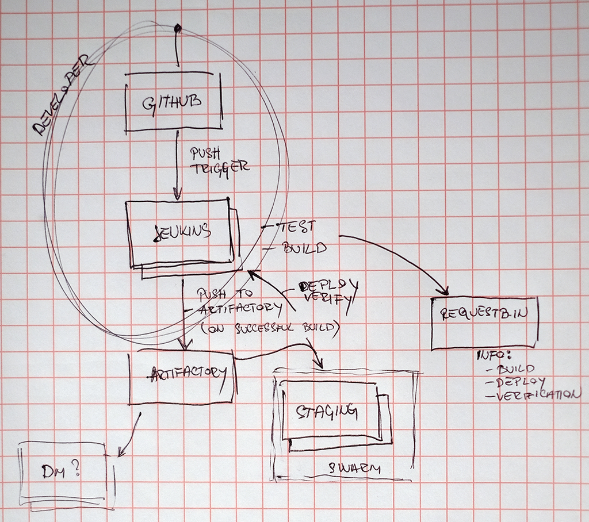

# Software Build & Release Pipeline


## Quickstart
Add webhook to you messaging-example GitHub repository. Repository used for this example is https://github.com/alen-z/messaging-example.git. Webhook example:
```
http://ec2-35-176-85-120.eu-west-2.compute.amazonaws.com:8080/git/notifyCommit?url=https://github.com/alen-z/messaging-example.git
```
Change Git Repository URL in [Jenkins pipeline](http://ec2-35-176-85-120.eu-west-2.compute.amazonaws.com:8080/job/messaging-example-v1/configure) to fit URL of your repository. Change gateway and processor `localhost` to <code>rabbitmq</code>.
### messaging-example/message-gateway/src/main/webapp/WEB-INF/web.xml
```xml
<init-param>
    <param-name>queueHost</param-name>
    <param-value>rabbitmq</param-value>
</init-param>
```
### messaging-example/message-processor/etc/config.properties 
```sh
# message broker hostname
queue.host=rabbitmq
```

Push new commit and voilà. `/message` endpoint is accessible at:
```
http://ec2-35-177-73-225.eu-west-2.compute.amazonaws.com:8080
```
## AWS EC2 instance access
Private key to access all instances is available as .pem.txt file from this repository. Feel free to check them out (side note: if you install miners we share the profits) even though I think this README describes majority, if not all, of the steps taken to build the pipeline. Connection example:
```sh
ssh -i "infobip.pem.txt" admin@ec2-35-176-85-120.eu-west-2.compute.amazonaws.com # jenkins
```
Jenkins and Artifactory are deployed as if they are hosted services which the assignment allows.
### Security Groups and VPC + subnet
All instances are in the same VPC and subnet. Swarm is one security group, Jenkins another and Artifactory has its own - primarily exposing only necessary public ports.

## Jenkins
Public URL:
```
http://ec2-35-176-85-120.eu-west-2.compute.amazonaws.com:8080
u: admin
p: demo
```
Jenkins is deployed with Docker from [official](https://github.com/jenkinsci/docker) base image [modified](https://github.com/alen-z/docker-jenkins/blob/master/Dockerfile) to include Maven and Docker.
Build and run Jenkins instance:
```sh
# Prepare jenkins_data directory
docker build -t jenkins . # Execute in Dockerfile directory from cloned https://github.com/alen-z/docker-jenkins
docker run --name jenkins -d -p 8080:8080 -p 50000:50000 -v /var/run/docker.sock:/var/run/docker.sock -v /home/admin/jenkins_data:/var/jenkins_home jenkins
```
Cool trick alert! Notice <code>-v /var/run/docker.sock:/var/run/docker.sock</code> - this allows Docker container running Jenkins to access Docker functionality of it's host. It solves a lot of problems as described [here](https://jpetazzo.github.io/2015/09/03/do-not-use-docker-in-docker-for-ci/). Some other configuration steps:
* Disable "Help make Jenkins better by sending anonymous usage statistics and crash reports to the Jenkins project"
* Add Artifactory reference in Configure System
* Add Maven reference in Global Tool Configuration for Maven Artifactory Plugin
* Add Docker reference in Global Tool Configuration
* Publish over SSH plugin
  * Add private key info to connect to Swarm manager
  * Allows only file transfer from directory relative to workspace

## Artifactory
Public URL:
```
http://ec2-35-177-100-87.eu-west-2.compute.amazonaws.com:8081
u: admin
p: demo
```
Deploy Artifactory with this command:
```sh
docker run --name artifactory --restart=always -d -v /home/admin/artifactory:/var/opt/jfrog/artifactory -p 8081:8081 docker.bintray.io/jfrog/artifactory-pro:latest
```
Since AWS EC2 t2.micro instances with small amount of RAM memory (1GB) are used, Artifactory crashed on me few times. Therefore <code>--restart=always</code> is introduced even though in production it is pretty common to use this flag regardless of this problem. To ensure Docker Swarm will work with Artifactory set `Admin - HTTP Settings` to `Repository Path`.

## Docker Swarm
Docker Swarm is deployed on three AWS EC2 instances. 1 manager and 2 slaves.
```sh
ssh -i "infobip.pem.txt" admin@ec2-35-177-73-225.eu-west-2.compute.amazonaws.com # swarm master
docker swarm init --advertise-addr 172.31.3.210

ssh -i "infobip.pem.txt" admin@ec2-35-178-67-105.eu-west-2.compute.amazonaws.com # swarm worker1
ssh -i "infobip.pem.txt" admin@ec2-35-177-166-25.eu-west-2.compute.amazonaws.com # swarm worker2
docker swarm join --token xxx 172.31.3.210:2377
```
All instances contain `/etc/docker/daemon.json` to be used with our internal Artifactory repository:
```json
{
  "insecure-registries" : ["ec2-35-177-100-87.eu-west-2.compute.amazonaws.com:8081"]
}
```
Mandatory Docker service restart to apply changes and then login:
```sh
service docker restart
docker login -u user -p pass ec2-35-177-100-87.eu-west-2.compute.amazonaws.com:8081
```

## RabbitMQ
RabbitMQ is depoloyed as always-running service. We could use `docker stack deploy` with `docker-compose.yml` but it complicates things in this example because there should be a script waiting until RabbitMQ host becomes available for message-processor to start.
```sh
docker service create --name rabbitmq \
                        --replicas 1 \
                        --publish 5672:5672 \
                        rabbitmq
```
## Overlay network
Ingress (default) is a special-purpose network overlay therefore we need new overlay network for our service discovery:
```sh
docker network create -d overlay staging
docker service update --network-add staging rabbitmq 
```
Jenkins uses remote SSH command execution plugin "Publish over SSH" to start services from Swarm manager instance. Example of `docker service start`:
```sh
docker service create --name message-processor --replicas 1 --network staging --with-registry-auth ec2-35-177-100-87.eu-west-2.compute.amazonaws.com:8081/docker-local/message-processor:latest
docker service create --name message-gateway --replicas 1 --network staging --with-registry-auth --publish published=8080,target=8080 ec2-35-177-100-87.eu-west-2.compute.amazonaws.com:8081/docker-local/message-gateway:latest
```
`message-processor` accepts optional `JAR_FILENAME` enviromental variable. Please refer to [Jenkins pipline configuration](http://ec2-35-176-85-120.eu-west-2.compute.amazonaws.com:8080/job/messaging-example-v1/configure) for more info.

## RequestBin
While testing [requestb.in](https://requestb.in/175v6me1?inspect), sometimes I encountered unavailable application (Heroku PaaS) and Internal Server Error so be advised that this can break the build success status. It can be addressed with ping prior to sending the request.

## Future work
* Reverse proxy to Artifactory to secure connection with SSL certificate. This will remove the need for `docker login` insecure connection setup.
* Use local Dockerfile builds, not public binaries.
* Use explicit versions (ex. 1.2.3) for system dependencies in Dockerfiles, not tags (ex. lts).
* Deploy stack in Swarm using docker-compose.yml
* Enable promoting artifacts for production
* Expand Jenkins pipeline review report: coding standards and dependency analysis, code duplication, coverage...
* Parameterize application variables vital to run as Docker container in different environments (ex. queue host)
* Notify relevant party on broken build
